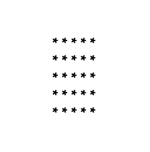
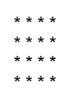
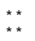

Pattern-1: Rectangular Star Pattern

Problem Statement: Given an integer N, print the following pattern.

Given an integer n. You need to recreate the pattern given below for any value of N. Let's say for N = 5, the pattern should look like as below:

    
       *****
       *****
       *****
       *****
       *****
    

Print the pattern in the function given to you.

Example 1
    Input: n = 4

    Output:

Example 2
    Input: n = 2

    Output:

Constraints :  1 <= n <= 100
   

Approach

   Algorithm  
       
       Intuition: The task is to print a square pattern of stars. Since the number of rows and columns are equal, we can use two nested loops: the outer one for rows and the inner one for printing N stars per row.

            Take an integer N as input to define the size of the square.
            Use a loop from 0 to N-1 to represent each row.
            Inside that loop, use another loop from 0 to N-1 to print stars in the current row.
            Print "* " during each inner loop iteration to form the row.
            After each inner loop completes, move to the next line.

Code 

    class Solution {

          // Function to print a square pattern of stars

        public void pattern1(int N) {

          // Outer loop to handle rows

            for (int i = 0; i < N; i++) {

              // Inner loop to handle columns for each row

                for (int j = 0; j < N; j++) {

                  // Print a star followed by a space

                  System.out.print("* ");
                }
              // After printing stars in a row, move to the next line
             System.out.println();
            }
        }

        public static void main(String[] args) {
            Solution sol = new Solution();
            int N = 5; // Set the size of the square (5x5)
            sol.pattern1(N); // Call the function to print the pattern
        }
    }

Complexity Analysis
     
     Time Complexity: O(N²), since we print N stars for each of the N rows.

     Space Complexity: O(1), no additional space is used apart from loop variables.