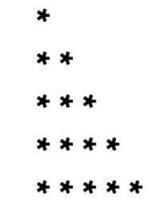
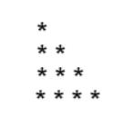
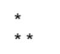

Pattern-2: Right-Angled Triangle Pattern

Problem Statement: Given an integer N, print the following pattern : 

Given an integer n. You need to recreate the pattern given below for any value of N. Let's say for N = 5, the pattern should look like as below:

           *

           **

           ***

           ****

           *****

Print the pattern in the function given to you.

Example 1
     Input: n = 4

     Output:

Example 2
      Input: n = 2

      Output:

Constraints :  1 <= n <= 100

Approach

      Algorithm

    This is one of the simplest star patterns. We need to form a right-angled triangle where the number of stars in each row increases line by line. Row i contains exactly i + 1 stars.

       Run an outer loop from 0 to N-1 to handle rows.
       For each row i, run an inner loop from 0 to i.  
       In the inner loop, print a star (*).
       After finishing the stars of one row, move to the next line using endl.

Code 
    class Solution {

             // Function to print Pattern 2

            public void pattern2(int N) {
                 // Loop for rows

                for (int i = 0; i < N; i++) {
                         // Loop for columns (stars in each row)

                    for (int j = 0; j <= i; j++) {
                        System.out.print("* ");
                    }

                    // Move to next line after each row

                    System.out.println();
                }
            }

            public class Main {
                public static void main(String[] args) {

                       // Create solution object

                       Solution sol = new Solution();

                       // Define N

                       int N = 5;

                       // Call pattern function

                       sol.pattern2(N);
                }
            }
    }

Complexity Analysis  
     Time Complexity: O(N2), Outer loop runs N times, and inner loop runs up to N stars cumulatively.

     Space Complexity: O(1), No extra space is used apart from loop counters.