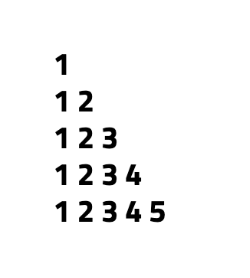
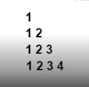
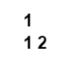

Pattern - 3: Right-Angled Number Pyramid

Problem Statement: Given an integer N, print the following pattern : 

Given an integer n. You need to recreate the pattern given below for any value of N. Let's say for N = 5, the pattern should look like as below:

             1

             12

             123

             1234

             12345

Print the pattern in the function given to you.

Example 1
     Input: n = 4

     Output:

   

Example 2
     Input: n = 2

     Output:

Constraints :  1 <= n <= 100

Approach
     Algorithm 
         We need to print a right-angled triangle where each row contains numbers starting from 1 up to the row number. So, the first row has 1, the second row has 1 2, the third row has 1 2 3, and so on until N.

             Use an outer loop (i) from 1 to N for rows.
             For each row, use an inner loop (j) from 1 to i to print numbers.
             Each row prints numbers starting from 1 up to the current row index.
             After printing each row, move to the next line.

Code 

        class Solution {

              // Function to print the number pattern

            public void pattern3(int N) {

              // Outer loop for rows

                for (int i = 1; i <= N; i++) {

                         // Inner loop for columns

                         // Print numbers from 1 to i

                    for (int j = 1; j <= i; j++) {
                         System.out.print(j + " ");
                    }

                    // Move to the next row

                    System.out.println();
                }
            }

            public class Main {
                public static void main(String[] args) {

                     // Create object of Solution class

                     Solution sol = new Solution();

                     // Define size of pattern

                     int N = 5;

                     // Call pattern function

                     sol.pattern3(N);
                }
            }
        }

Complexity Analysis

         Time Complexity: O(N²), because the outer loop runs N times and the inner loop runs up to i times for each row.

         Space Complexity: O(1), since only loop variables are used.