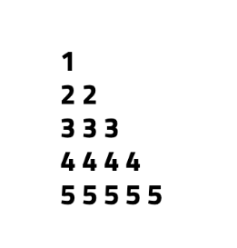
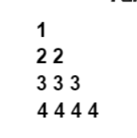
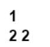

Pattern - 4: Right-Angled Number Pyramid - II

Problem Statement: Given an integer N, print the following pattern.

Given an integer n. You need to recreate the pattern given below for any value of N. Let's say for N = 5, the pattern should look like as below:

             1

             22

             333

             4444

             55555

Print the pattern in the function given to you.

Example 1
     Input: n = 4

     Output:

Example 2
     Input: n = 2

     Output:

Constraints :  1 <= n <= 100

Approach

     Algorithm 

             In this pattern, instead of printing increasing numbers from 1 to i in each row, we print the row number itself repeatedly. For example, the first row prints 1, the second row prints 2 2, the third row prints 3 3 3, and so on until N.

             Use an outer loop (i) from 1 to N for rows.
             For each row, use an inner loop (j) from 1 to i.
             Instead of printing j, print i (the current row number).
             After completing one row, move to the next line.

Code

        class Solution {

                 // Function to print the pattern

            public void pattern4(int N) {

                      // Outer loop for rows

                for (int i = 1; i <= N; i++) {

                     // Inner loop for columns

                    for (int j = 1; j <= i; j++) {

                         // Print the row number 'i' in each column
                         System.out.print(i + " ");
                    }
                    // Move to the next row

                    System.out.println();
                }
            }

            public class Main {
                 public static void main(String[] args) {

                     // Create object of Solution class

                     Solution sol = new Solution();

                     // Define size of pattern

                     int N = 5;

                     // Call pattern function

                     sol.pattern4(N);
                }
            }
        }

Complexity Analysis

         Time Complexity: O(N²), because there are two nested loops: the outer loop for rows and the inner loop for printing numbers.

         Space Complexity: O(1), as only loop variables are used.