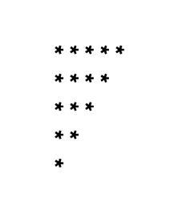
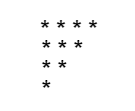
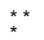

Pattern-5: Inverted Right Pyramid

Problem Statement: Given an integer N, print the following pattern : 

Given an integer n. You need to recreate the pattern given below for any value of N. Let's say for N = 5, the pattern should look like as below:

    
         *****

         ****

         ***

         **

         *

Print the pattern in the function given to you.

Example 1
     Input: n = 4

     Output:

Example 2
     Input: n = 2

     Output:

Constraints :  1 <= n <= 100
   

Approach

     Algorithm

             In this pattern, the number of stars decreases in each row. The first row has N stars, the second row has N-1, the third has N-2, and so on, until only one star remains in the last row. This creates an inverted right-angled triangle.

                     Run an outer loop (i) from 0 to N-1 for rows.
                     For each row, run an inner loop (j) starting from N down to i+1.
                     Print a star (*) in each iteration of the inner loop.
                     After finishing each row, print a newline to move to the next row.

Code

        class Solution {
                 // Function to print Pattern 5
                public void pattern5(int N) {
                     // Outer loop for rows
                    for (int i = 0; i < N; i++) {
                         // Inner loop for columns
                         
                        for (int j = N; j > i; j--) {
                             // Number of stars decreases with each row
                             System.out.print("* ");
                        }
                        // Move to next line
                        System.out.println();
                    }
                }

                public class Main {
                    public static void main(String[] args) {
                         // Create object of Solution class
                         Solution sol = new Solution();

                         // Define size of pattern
                         int N = 5;

                         // Call pattern function
                         sol.pattern5(N);
                    }
                }
        }

Complexity Analysis
     
     Time Complexity: O(N²), since we print N stars for each of the N rows.

     Space Complexity: O(1), no additional space is used apart from loop variables.