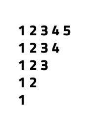
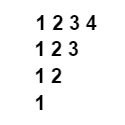
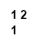

Pattern - 6: Inverted Numbered Right Pyramid

Problem Statement: Given an integer N, print the following pattern.

Given an integer n. You need to recreate the pattern given below for any value of N. Let's say for N = 5, the pattern should look like as below:

    
         12345

         1234

         123

         12

         1

Print the pattern in the function given to you.

Example 1
     Input: n = 4

     Output:

Example 2
     Input: n = 2

     Output:

Constraints :  1 <= n <= 100
   

Approach

     Algorithm

             This pattern looks similar to an inverted right-angled triangle, but instead of stars, we print numbers. Each row starts from 1 and continues up to N - i, where i is the current row index. Thus, the number of elements decreases with each row, creating an inverted triangle of numbers.

                     Run an outer loop (i) from 0 to N-1 for rows.
                     Inside it, run an inner loop (j) from N down to i+1.
                     Print numbers starting from 1 to N - i using the formula (N - j + 1).
                     After finishing each row, print a newline.

Code

        class Solution {
             // Function to print Pattern 6
            public void pattern6(int N) {
                 // Outer loop for rows
                for (int i = 0; i < N; i++) {
                     // Inner loop for columns
            
                    for (int j = N; j > i; j--) {
                         // Prints numbers from 1 up to (N - i)
                        System.out.print((N - j + 1) + " ");
                    }
                     // Move to next line
                     System.out.println();
                }
            }

            public class Main {
                public static void main(String[] args) {
                     // Create object of Solution class
                     Solution sol = new Solution();

                     // Define size of pattern
                     int N = 5;

                     // Call pattern function
                     sol.pattern6(N);
                }
            }
        }

Complexity Analysis

         Time Complexity: O(N²), because nested loops iterate across the triangular number of elements.

         Space Complexity: O(1), as no extra data structures are used.