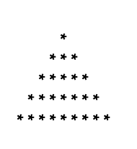
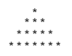
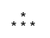

Pattern - 7: Star Pyramid

Problem Statement: Given an integer N, print the following pattern.

Given an integer n. You need to recreate the pattern given below for any value of N. Let's say for N = 5, the pattern should look like as below:

             *
            ***
           *****
          *******
         *********

Print the pattern in the function given to you.

Example 1
     Input: n = 4

     Output:

Example 2
     Input: n = 2

     Output:

Constraints :  1 <= n <= 100
   

Approach

     Algorithm

         In this pattern, we form a pyramid of stars. Each row contains:

             (N - i - 1) spaces on the left (to center align the stars),
             (2 * i + 1) stars in the middle,
             (N - i - 1) spaces on the right.
         This ensures symmetry and creates a proper pyramid shape.
             Run an outer loop (i) from 0 to N-1 for rows.
             Print N - i - 1 spaces before the stars.
             Print 2 * i + 1 stars.
             Print N - i - 1 spaces again (optional, only for symmetry in visualization).
             Move to the next line after each row.

Code

        class Solution {
                 // Function to print Pattern 7
            public void pattern7(int N) {
                 // Outer loop for rows
                for (int i = 0; i < N; i++) {

                     // Print leading spaces
                    for (int j = 0; j < N - i - 1; j++) {
                         System.out.print(" ");
                    }

                     // Print stars
                    for (int j = 0; j < 2 * i + 1; j++) {
                         System.out.print("*");
                    }

                     // Print trailing spaces
                    for (int j = 0; j < N - i - 1; j++) {
                         System.out.print(" ");
                    }

                     // Move to next row
                     System.out.println();
                }
            }

            public class Main {
                public static void main(String[] args) {
                     Solution sol = new Solution();
                     int N = 5;
                     sol.pattern7(N);
                }
            }
        }

Complexity Analysis

         Time Complexity: O(N²), since nested loops print about N² characters overall.

         Space Complexity: O(1), as no extra data structures are required.